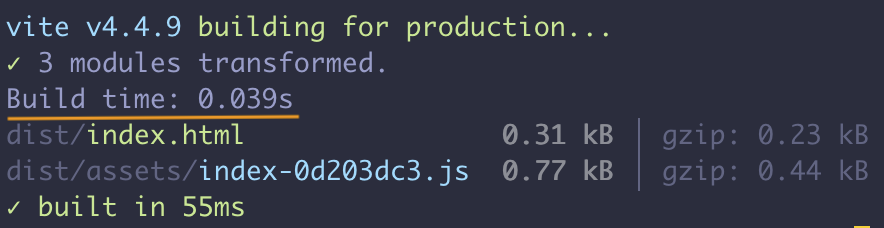

# unplugin-time-stat

[![npm version][npm-version-src]][npm-version-href]
[![CI][ci-src]][ci-href]

Build time stat reporting for [unplugin](https://github.com/unjs/unplugin).

## 🙋 Motivations

- Each bundler has a different way of getting stats build times
  - webapck / rspack: stat json generated with the `--json` or `--analyzer` option
  - vite / rollup: stat via 3rd party plugin

## 🌟 Features

### build time output console



### custom hook

You can hook for build output time.

example for vite plugin case:

```ts
import TimeStat from 'unplugin-time-stat/vite'

function metrics(buildTime, { start, end }) {
  // Something hooking (ex. send metrics service like datadog)
  // ...

  // if you will return a string, it's output to console
  return `Build time: ${raw.end.getTime() - raw.start.getTime()}ms`
}

export default {
  plugins: [
    TimeStat({
      hook: metrics
    })
  ]
}
```

## 💿 Install

```sh
# Using npm
npm install unplugin-time-stat

# Using yarn
yarn add unplugin-time-stat

# Using pnpm
pnpm add unplugin-time-stat

# Using bun
bun add unplugin-time-stat
```

## 🚀 Usages

<details>
<summary>Vite</summary><br>

```ts
// vite.config.ts
import TimeStat from 'unplugin-time-stat/vite'

export default defineConfig({
  plugins: [
    TimeStat({
      /* options */
    })
  ]
})
```

build example: [`playground/`](./playground/)

<br></details>

<details>
<summary>Rollup</summary><br>

```ts
// rollup.config.js
import TimeStat from 'unplugin-time-stat/rollup'

export default {
  plugins: [
    TimeStat({
      /* options */
    })
  ]
}
```

<br></details>

<details>
<summary>Webpack</summary><br>

```ts
// webpack.config.js
module.exports = {
  /* ... */
  plugins: [
    require('unplugin-time-stat/webpack')({
      /* options */
    })
  ]
}
```

<br></details>

<details>
<summary>Nuxt</summary><br>

```ts
// nuxt.config.js
export default defineNuxtConfig({
  modules: [
    [
      'unplugin-time-stat/nuxt',
      {
        /* options */
      }
    ]
  ]
})
```

> This module works for both Nuxt 2 and [Nuxt Vite](https://github.com/nuxt/vite)

<br></details>

<details>
<summary>Vue CLI</summary><br>

```ts
// vue.config.js
module.exports = {
  configureWebpack: {
    plugins: [
      require('unplugin-time-stat/webpack')({
        /* options */
      })
    ]
  }
}
```

<br></details>

<details>
<summary>esbuild</summary><br>

```ts
// esbuild.config.js
import { build } from 'esbuild'
import TimeStat from 'unplugin-time-stat/esbuild'

build({
  plugins: [TimeStat()]
})
```

<br></details>

<details>
<summary>Rspack</summary><br>

```ts
// rspack.config.js
module.exports = {
  /* ... */
  plugins: [
    require('unplugin-time-stat/rspack')({
      /* options */
    })
  ]
}
```

<br></details>

## 🛠️ Plugin options

See the [here](https://github.com/kazupon/unplugin-time-stat/blob/main/src/types.ts)

## 🙌 Contributing guidelines

If you are interested in contributing to `unplugin-time-stat`, I highly recommend checking out [the contributing guidelines](/CONTRIBUTING.md) here. You'll find all the relevant information such as [how to make a PR](/CONTRIBUTING.md#pull-request-guidelines), [how to setup development](/CONTRIBUTING.md#development-setup)) etc., there.

## ©️ License

[MIT](https://opensource.org/licenses/MIT)

<!-- Badges -->

[npm-version-src]: https://img.shields.io/npm/v/unplugin-time-stat?style=flat
[npm-version-href]: https://npmjs.com/package/unplugin-time-stat
[npm-downloads-src]: https://img.shields.io/npm/dm/unplugin-time-stat?style=flat
[npm-downloads-href]: https://npmjs.com/package/unplugin-time-stat
[ci-src]: https://github.com/kazupon/unplugin-time-stat/actions/workflows/ci.yml/badge.svg
[ci-href]: https://github.com/kazupon/unplugin-time-stat/actions/workflows/ci.yml
